# Active Directory & IT Support Home Lab

## Overview

I built this home lab to practice common L1 IT Support and Desktop Support tasks in a Windows domain environment.

Using Windows Server 2019 and a Windows 11 client in Oracle VirtualBox, I configured and tested Active Directory users, shared folder permissions, account management, and domain access.

## Lab Setup

- Oracle VirtualBox
- Windows Server 2019
- Windows 11
- Active Directory Domain Services
- Domain: `corp.local`

## What I Configured and Tested

- Created HR, IT, and Sales Organizational Units (OUs)
- Created and managed domain user accounts
- Joined a Windows 11 client to the domain
- Configured shared folders and NTFS permissions
- Tested authorized and unauthorized folder access
- Tested account lockout and account unlock
- Reset a user password and tested **User must change password at next logon**
- Created a new user account as a basic onboarding task

## Screenshots

### Lab Environment

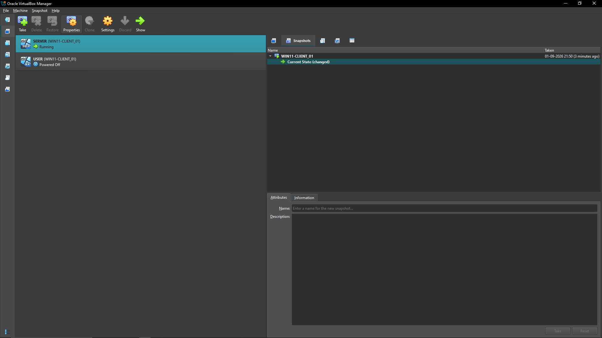

### Active Directory Structure

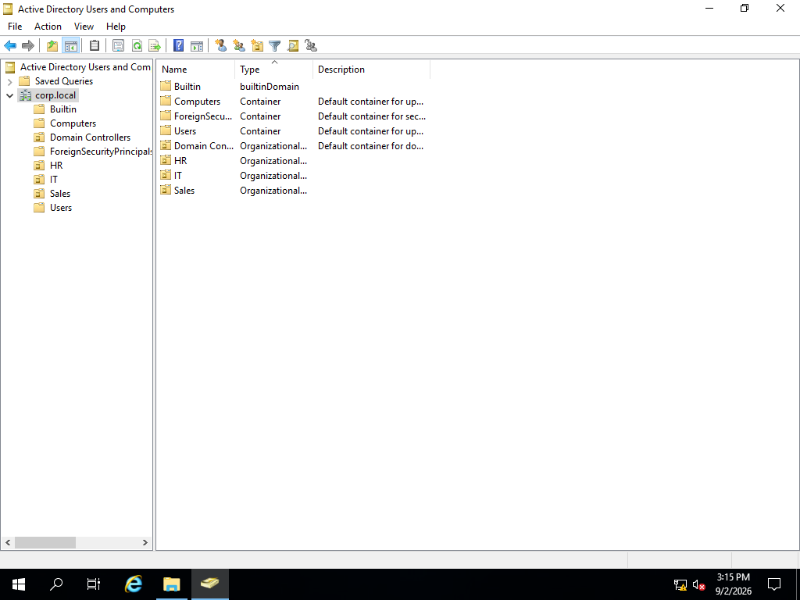

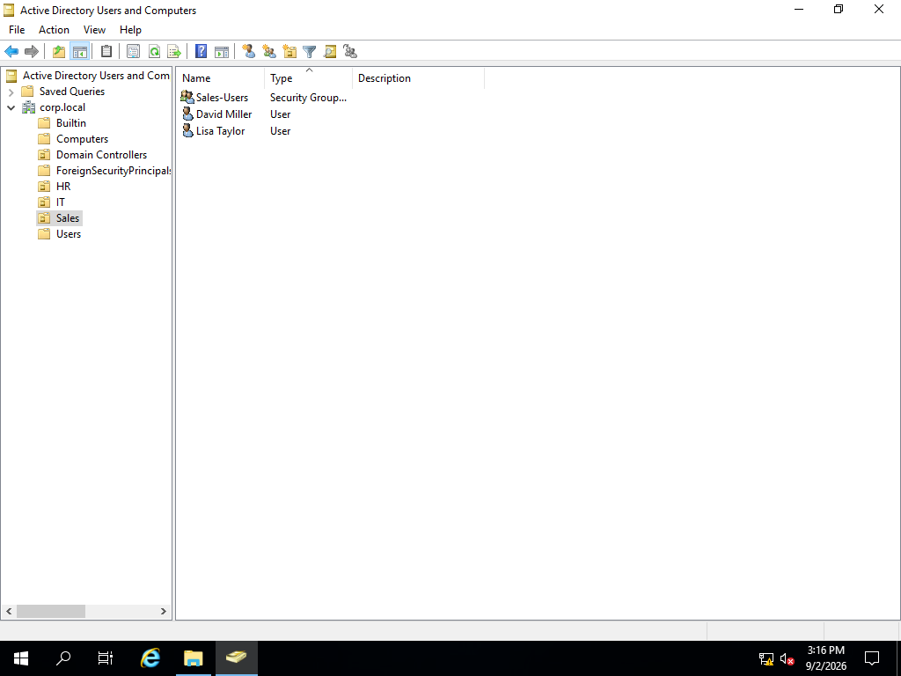

### Domain Join

### NTFS Permissions

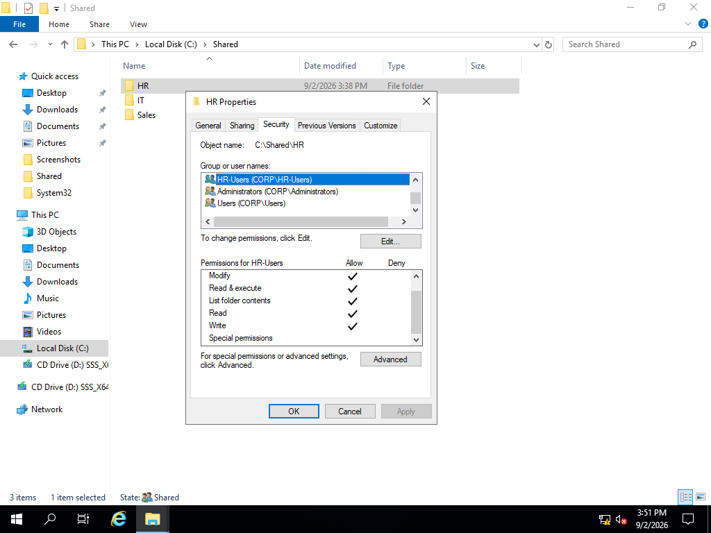

### File Access Testing

**1. John Smith logged in as a domain user**

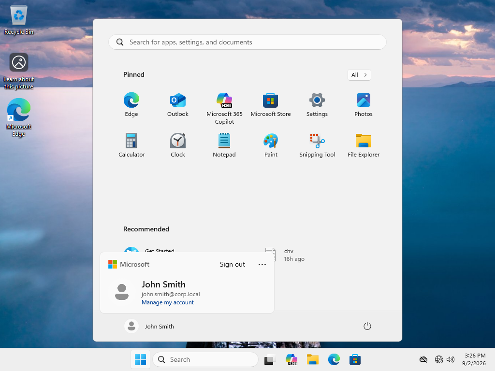

**2. Authorized access to the IT shared folder**

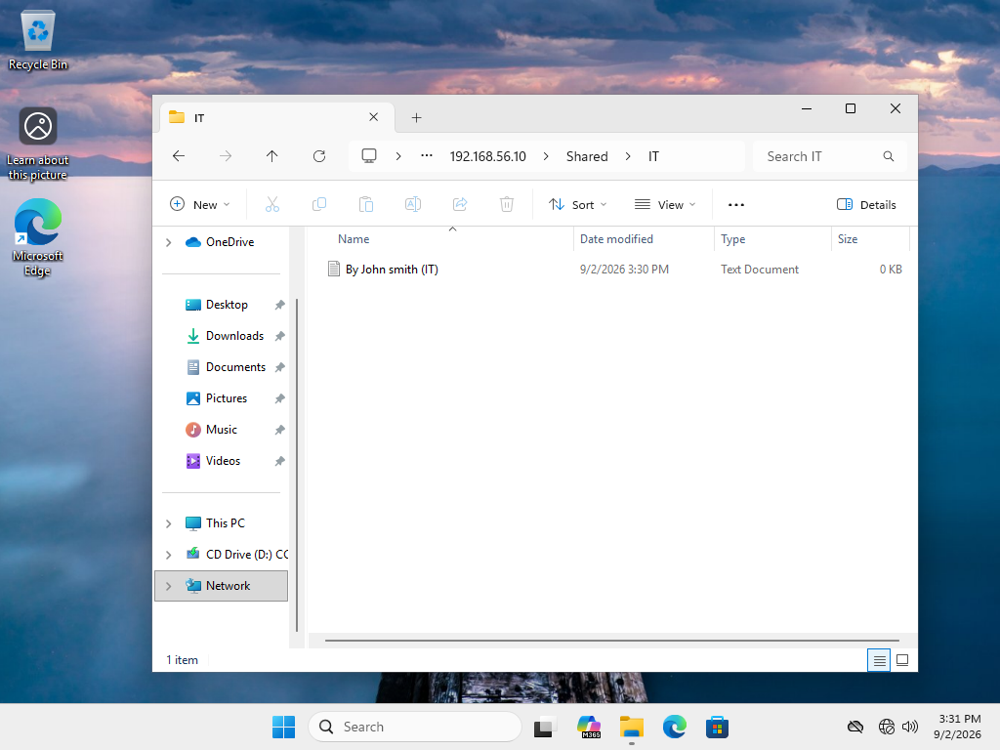

**3. Unauthorized access to the HR shared folder**

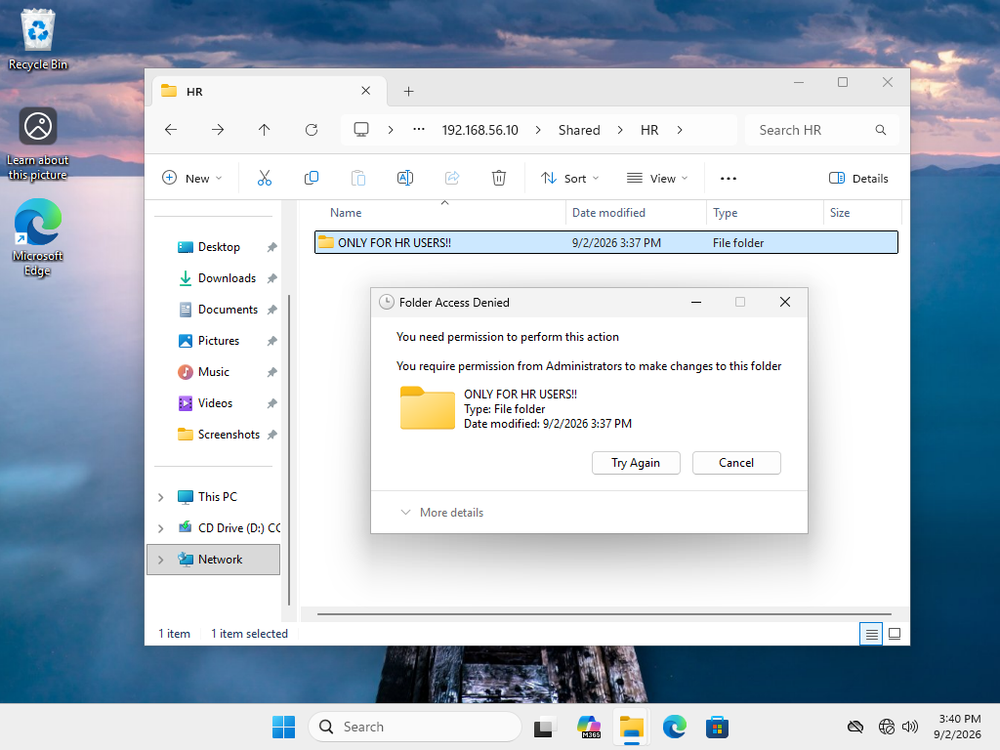

### Account Lockout and Unlock

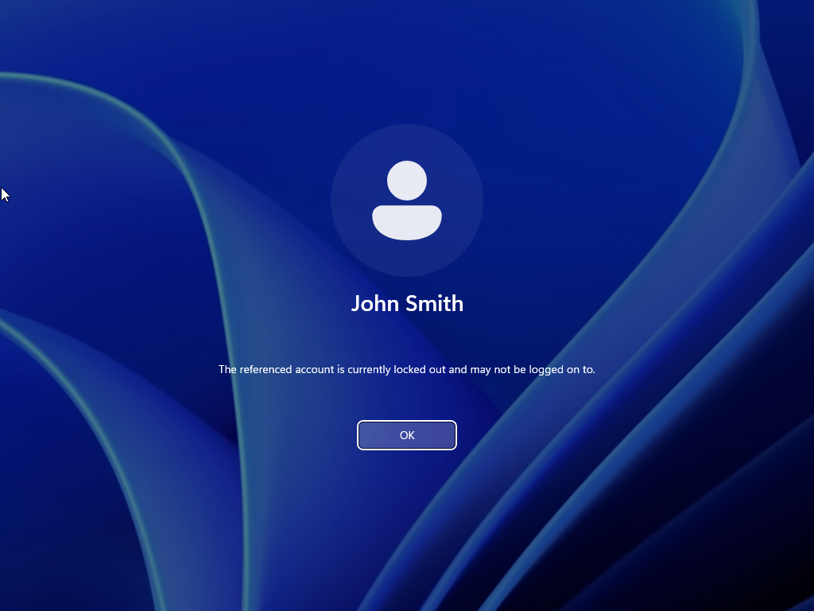

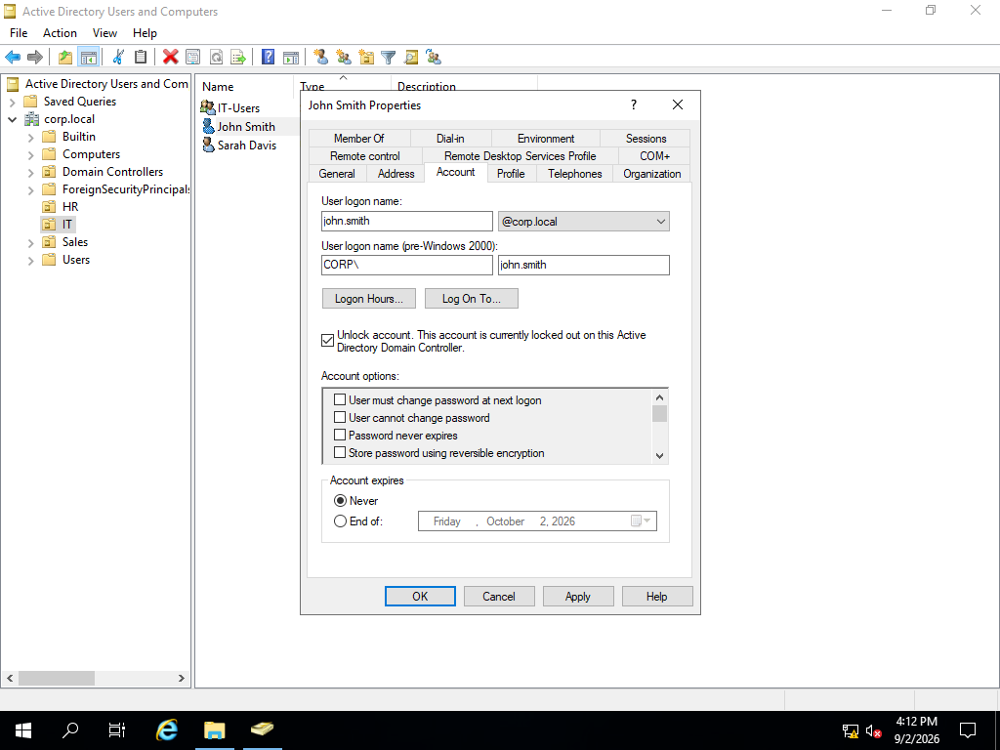

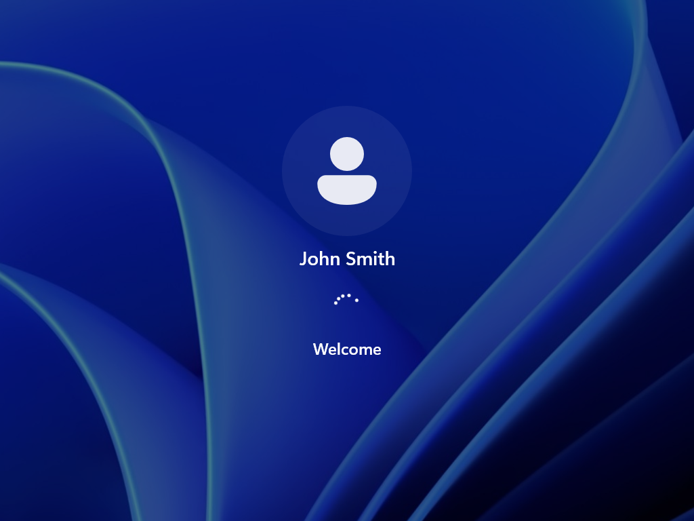

### Password Reset

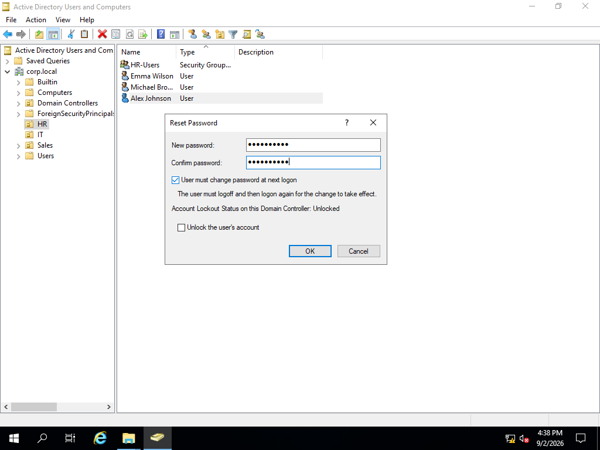

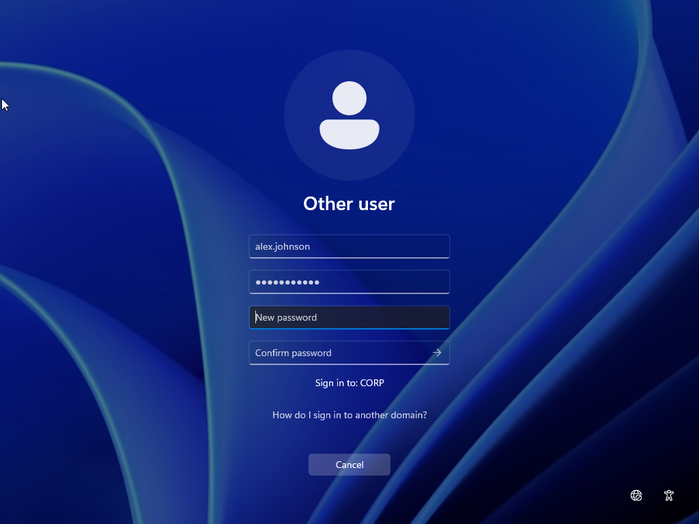

### User Onboarding

## Skills Practiced

- Active Directory user and OU management
- Windows domain joining
- NTFS permissions
- Shared folder access
- Basic access troubleshooting
- Account lockout and unlock
- Password resets
- Basic user onboarding
